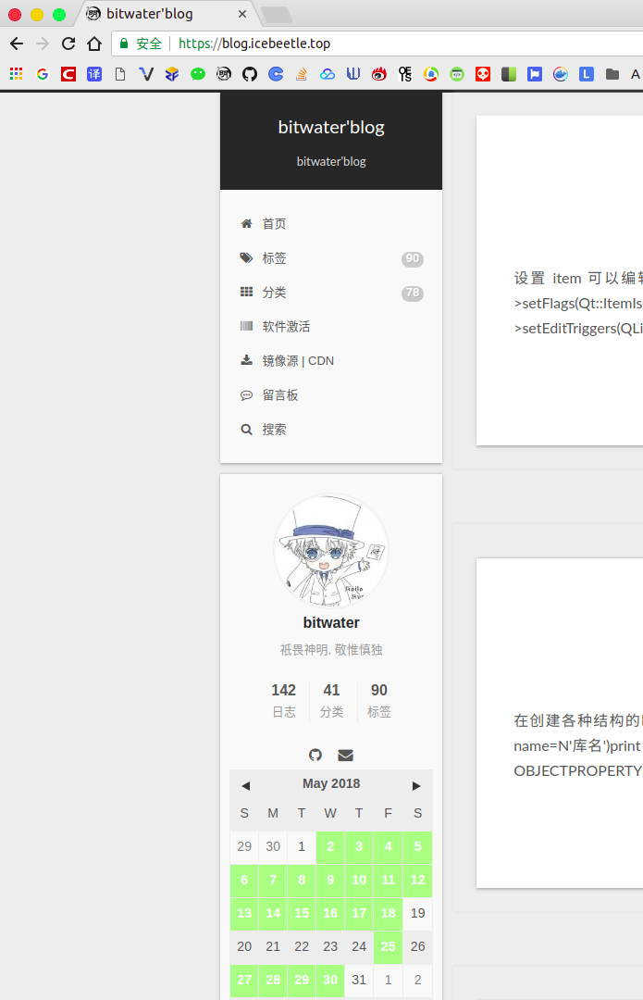

# Hexo-Next-Plugins-Calendar

一个简洁的hexo-next日历云插件



### 安装

安装分两步

首先安装hexo插件

```
npm install --save git://github.com/bitwater1997/hexo-generator-calendar.git
```

然后安装next部分

仓库一共四个文件,把文件放到指定位置

-   CloudCalendar.swig   -> themes/next/layout/_third-party/CloudCalendar.swig
-   CloudCalendar.styl     -> themes/next/source/css/_common/components/third-party/CloudCalendar.styl
-   CloudCalendar.js        -> themes/next/source/lib/CloudCalendar/CloudCalendar.js
-   languages.js                -> themes/next/source/lib/CloudCalendar/languages.js

然后把这四个文件导入到主题中

1.  在文件`themes/next/source/css/_common/components/third-party/third-party.styl` 最后加入

    `@import "CloudCalendar" if hexo-config('CloudCalendar.enable');`

2.  在文件`/home/bitwater/Desktop/Blog/themes/next/layout/_layout.swig`最后加入

    ``

3.  在文件_config.yml 加入

    ```yaml
    # 日历云
    CloudCalendar:
      enable: true
      language: zh-CN
      single: true
      root: /calendar/
    ```

### 渲染日历

在指定的位置呈现日历云

我选择的位置是sidebar中的用户后面, 当然可以根据喜好更改

在文件`themes/next/layout/_macro/sidebar.swig` 中的 133行后添加

```html
{# Blogroll #}
<!-- CloudCalendar -->
<div class="widget-wrap">
	<div class="widget" id="CloudCalendar"></div>
</div>
```

### 自定义日历颜色

颜色的定义是放在CloudCalendar.styl中的, 大部分我都添加了注释, 少部分用不到的可以自行推断


### 感谢

该插件的实现离不开@[howiefh](https://github.com/howiefh)的开源支持, 部分代码是提取自他为Landscape-F制作的日历插件, 我将其修改后适配到了next主题.